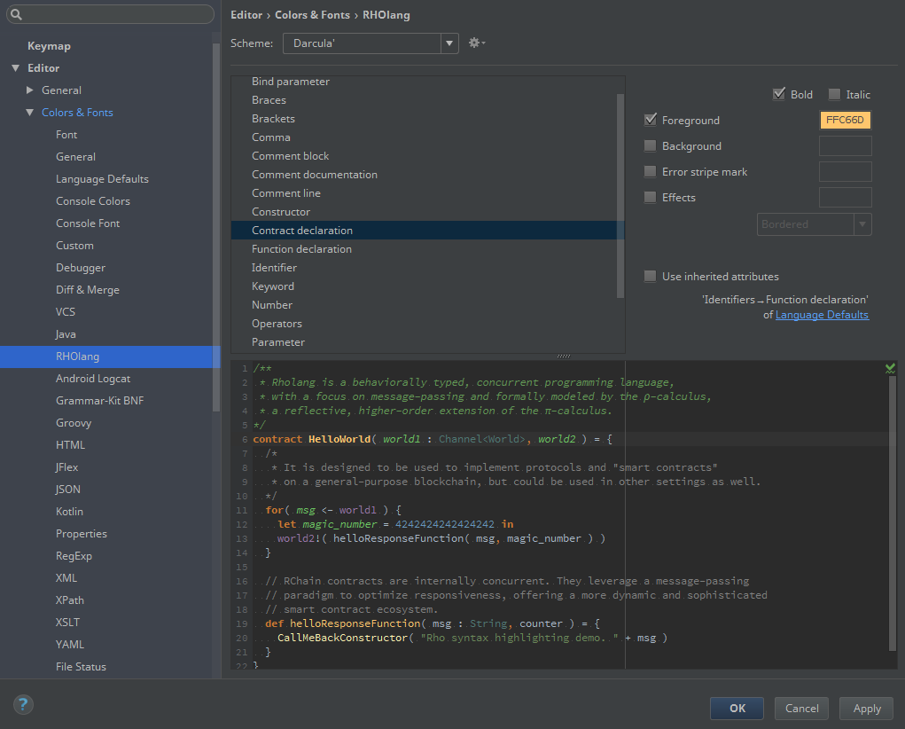

# Rholang IntelliJ IDEA language plugin

![beta][beta-badge]

This is the early stage of editor support for [Rholang][rho-github]. :smile:

For now, it has only support for syntax highlighting. I tried to make parser more forgiving so it can highlight wider range of correct programs. With more context information from compiler it could be much more precise.

> **Rholang** is a fully featured, general purpose, Turing-complete programming language built from the rho-calculus. It is a behaviorally typed, **r**-eflective, **h**-igher **o**-rder process language and the official smart contracting language of [RChain][rchain-coop]. Its purpose is to concretize fine-grained, programmatic concurrency. [RChain Architecture][arch-rholang]

Rholang is currently in active development and syntax can slightly change. Current version of plugin follows this version of [Rho grammar][rho-bnf-origin] and available examples.

I found interesting that many grammar rules have a strong gravity towards `Proc`ess :cyclone: but that should not be strange for π-calculus, _λ-expression_ is not the main _actor_ here. [Mobile process calculi for programming the new blockchain][tuplespaces-to-picalculus]

Programmers in concurrent languages such as Erlang/Elixir say that one of the hardest problems is to coordinate the names (locations) of processes. It seems that Rholang with [Namespace logic][arch-namespace-logic] looks like a great solution for coordination of resources.

With all this sweet superpowers, that comes with the Rholang compiler and type checker, it will be a pleasure to write smart contracts. :lollipop:

## Configure custom colors on the settings page

Only colors for _Constructor_ and _Bind parameter_ have no default values.

## Install

From [JetBrains Plugins Repository][rho-idea-plugin] searchable inside the editor.

Or download **rholang-idea.jar** from the [latest release][releases] and install through [File > Settings > Plugins][idea-install-from-disk] menu.

## [Contributing](./CONTRIBUTING.md)

Any feedback, suggestions, bugs, testing, pull-requests, issues are very welcome. :smile:

### Development

- setup [IntelliJ dev-plugin prerequisites][idea-dev-setup]
- open repo in the editor
- generate Java parser from `Rho.bnf` through the file context menu [Generate Parser Code][idea-gen-parser]
- generate Java lexer from `Rho.flex` through the file context menu [Run JFlex Generator][idea-gen-lexer]
- create new Plugin Run configuration with default setup
- run/debug in a separate editor

### Deployment

- generate _jar_ file through the project root context menu [Prepare Plugin Module ... For Deployment][idea-deploy]
- upload _jar_ to [JetBrains Plugins Repository][rho-idea-plugin] 

### TODO

- write Formatter
- write [Completion Contributor][idea-completion]
- write [Reference Contributor][idea-reference]
- add [plugin actions][idea-plugin-actions]
- connect with the compiler (get semantic info)
- ...

## License

[The MIT License (MIT)][license]

[releases]: https://github.com/tgrospic/rholang-idea/releases
[rchain-coop]: https://www.rchain.coop
[rho-github]: https://github.com/rchain/rchain/tree/master/rholang
[rho-bnf-origin]: https://github.com/rchain/rchain/blob/e1b77e7b942e8f1bc98d1e5fe7705f51c2e9440d/rholang/src/main/bnfc/rholang.cf
[rho-idea-plugin]: https://plugins.jetbrains.com/plugin/9833-rholang
[arch-rholang]: http://rchain-architecture.readthedocs.io/en/latest/contracts/contract-design.html#rholang-a-concurrent-language
[arch-namespace-logic]: http://rchain-architecture.readthedocs.io/en/latest/contracts/namespaces.html#namespace-logic
[tuplespaces-to-picalculus]: http://mobile-process-calculi-for-programming-the-new-blockchain.readthedocs.io/en/latest/actors-tuples-and-pi.html#from-tuplespaces-to-calculus

[idea-dev-setup]: http://www.jetbrains.org/intellij/sdk/docs/tutorials/custom_language_support/prerequisites.html
[idea-gen-parser]: http://www.jetbrains.org/intellij/sdk/docs/tutorials/custom_language_support/grammar_and_parser.html#generate-a-parser
[idea-gen-lexer]: http://www.jetbrains.org/intellij/sdk/docs/tutorials/custom_language_support/lexer_and_parser_definition.html#generate-a-lexer-class
[idea-deploy]: https://www.jetbrains.com/help/idea/preparing-plugins-for-publishing.html
[idea-install-from-disk]: https://www.jetbrains.com/help/idea/installing-a-plugin-from-the-disk.html
[idea-completion]: https://www.jetbrains.org/intellij/sdk/docs/tutorials/custom_language_support/completion_contributor.html
[idea-reference]: https://www.jetbrains.org/intellij/sdk/docs/tutorials/custom_language_support/reference_contributor.html
[idea-plugin-actions]: https://www.jetbrains.org/intellij/sdk/docs/basics/action_system.html

[beta-badge]: https://cdn.rawgit.com/tgrospic/rholang-idea/master/docs/beta-0.0.3.svg
[license]: https://github.com/tgrospic/rholang-idea/blob/master/LICENSE
